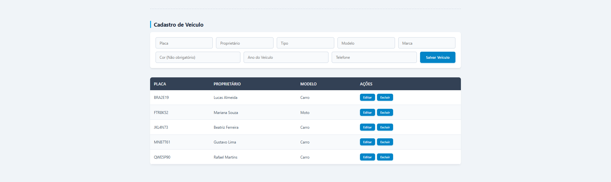
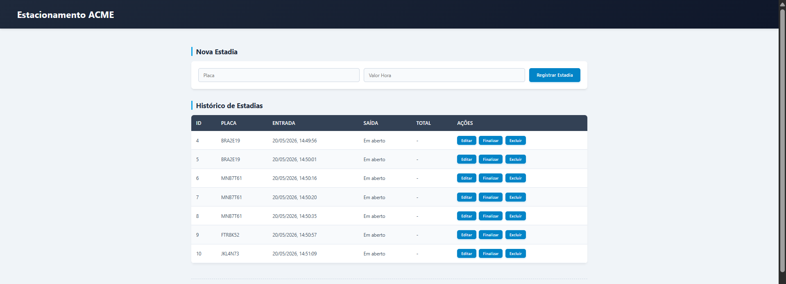

# ⚡ Estacionamento

> Solução inteligente para gestão de pátios, cadastro de veículos e controle automatizado de estadias com cálculo de tarifas em tempo real, com NODEJS, PRISMA, JAVASCRIPT E MYSQL.

---

## 🗺️ Documentações

Documentação do sistema:

### 📐 Estrutura de Classes 


### 👤 Casos de Uso 


### 🔄 Fluxo de Atividades 


---

## 📸 Interface do Usuário

Visualização das telas principais do sistema em funcionamento.

### Painel de Cadastro de Veículos


### Controle Operacional e Histórico de Estadias


---

## 🚀 Guia de Inicialização

### Pré-requisitos Mínimos
* **Node.js**
* **Gerenciador npm**

### 1. Clonagem e Dependências
Execute os comandos abaixo no seu terminal para baixar o projeto e instalar os pacotes necessários:
```bash
git clone 
cd Atividade-Fork_Estacionamento
npm install
